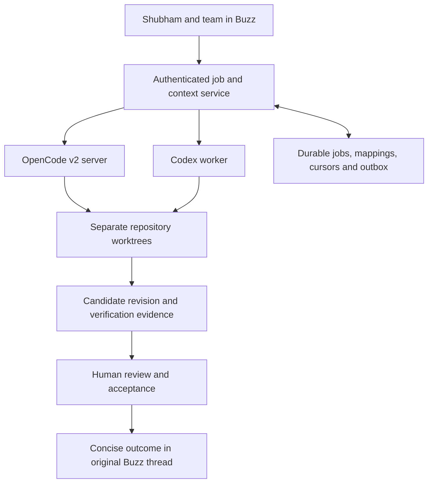

# Historical planning pilot

The working setup now lives at [BUZZ_SETUP.md](../../BUZZ_SETUP.md). Use `npm ci && npm run setup` from the repository root. The text below records the earlier planning-only pilot and is not the current implementation status.

# OpenCode v2 pilot for intuitxn

Prepared 2026-09-06. This is a runnable local planning profile and a proposed integration contract. It is not a deployed Buzz bridge or a port of the existing Telepathy v1 plugin.

## Installed locally

The CLI is pinned to `@opencode-ai/cli@0.0.0-beta-19192` at:

`~/.local/share/intuitxn-opencode-v2/node_modules/.bin/opencode2`

The existing `opencode` v1 binary remains available. Use the isolated launcher:

```sh
./run.sh --help
./run.sh
./run.sh api --standalone get /api/health
```

The launcher copies this pilot's instructions and config into a dedicated workspace outside the Telepathy checkout and into its isolated global config. It uses separate XDG config/data/state/cache directories. This avoids loading the parent repository's v1 plugin or migrating the account's existing OpenCode data. OpenCode still discovers home-level compatibility directories such as `~/.agents`; this is configuration/data separation, not an OS sandbox. Credentials are not copied. Connect a provider through `/connect` before requesting model work. Select a model actually offered by that connection; this profile deliberately has no guessed model ID.

`run.sh` needs `npm` and a platform supported by the OpenCode beta. On another host it installs the same pinned CLI when absent. This is a foreground/local pilot, not a service manager or production deployment script.

## Local verification

The pinned CLI reports its version; the isolated health API reports healthy; config discovery recognizes this profile; after plugin activation settles, the agent catalog contains `intuitxn-plan` with edit, shell and subagent execution denied. The service API defaults to the home Location, which is why the pilot profile is also installed in the isolated global config. The test service was stopped after verification. No model calls or Buzz writes were made.

## Proposed shared backend



One server machine can host the bridge, OpenCode process, Codex workers, worktrees, and local database. The existing hosted Buzz relay remains a separate dependency, as do hosted model providers. This does not imply that the entire stack is one Node.js process or runs models locally.

Use one durable job authority. Adapt Agent Manager if its existing job API is available; otherwise explicitly select the bridge's job store before implementation. Do not create competing job state in Buzz, Agent Manager, and OpenCode.

## State and context contract

| Store | Responsibility |
| --- | --- |
| Buzz | Human requests, discussions, explicit acceptance and communication receipts |
| Git | Versioned agent profiles, instructions, source, candidate and accepted revisions |
| Job authority | Job state, human owner/reviewer, runtime/session mapping, leases, retries and budget |
| OpenCode/Codex | Their own execution sessions and tool history |
| Context/artifact storage | Source-linked briefs, accepted decisions, test evidence, outputs |

Every dispatched job should carry `job_id`, `source_event_id`, `channel_id`, `thread_root_id`, `requester_pubkey`, `owner`, `reviewer`, `repository`, `base_revision`, `worktree`, `acceptance_criteria`, `context_refs`, `context_version`, `runtime`, `session_id`, `budget`, and `authorization_scope`. These are proposed bridge fields, not OpenCode or Buzz API properties.

Keep permanent instructions short in AGENTS.md. Load the current job brief as task input. Use versioned files/references for larger context and record the exact revisions used. Store durable accepted decisions separately from lossy conversation compaction. Never elevate arbitrary Buzz messages to system instructions.

## Communication and recovery

Dispatch only explicit assigned work from configured channels and authorized people. Deduplicate source events by ID, ignore the bridge's own output as new assignments, and keep one execution lease per job. Poll Buzz using the installed CLI's supported cursor options; overlap timestamp windows, deduplicate IDs, and handle full pages before advancing a watermark.

OpenCode event subscriptions are live-only. Reconnect explicitly and reconcile session/message state after disconnect or restart. Never use the event stream alone as the durable task queue. An ambiguous prompt submission must be reconciled against persisted session/input state before retrying.

Use an outbox for authorized messages. Persist the originating thread, sender, content hash, delivery state and returned event ID. An ambiguous send needs reconciliation before retry. Mark delivery only on `accepted: true`; preserve explicit mention identities. A signed agent post must remain attributable to that agent, with human approval recorded separately.

## Codex boundary

The installed Codex CLI supports `codex exec`, `--json`, `--output-schema`, `--output-last-message`, `--cd`, and session resumption. A worker can receive the same job brief on stdin and return structured results with a worktree diff and verification evidence. Invoke using an argument array, not an interpolated shell command. Configure its credentials and execution policy separately; OpenCode agent profiles do not configure a Codex runtime automatically.

## Migration and acceptance checklist

1. Port `plugins/telepathy` from the v1 function/hooks API to the v2 `Plugin.define` API; validate against pinned package types and an actual v2 server. Do not enable it in this pilot before that work.
2. Build the job adapter and recoverable Buzz input/output path described above. Keep provider and Buzz credentials in the owning service environment, outside shared configuration.
3. Connect an authorized Buzz agent identity. Verify membership with a read. The old setup document's membership failure is historical evidence, not proof of current membership status.
4. Verify one explicit request can produce a job, a runtime session, a tested artifact and an authorized reply in its original thread.
5. Restart the bridge mid-job and prove no duplicate execution or reply. Verify another team member can see the accepted outcome using their own identity.
6. Deploy behind authenticated access with loopback-only runtime endpoints, per-job workspace isolation, concurrency limits, disk monitoring and restorable backups. A shared OpenCode process is not a per-member authorization boundary.

## Current limits

- No Buzz credentials or owner attestation are present in this shell; no Buzz membership read or message send was performed.
- No target server was supplied. No remote deployment or automatic startup service was configured.
- The legacy v1 plugin remains unchanged and is not loaded by this pilot.
- No provider/model run has been verified. A health/config probe alone does not establish end-to-end application building.
- Session sharing is unimplemented in v2. Do not use `session.share` or the parsed `share` field to provide team access.

## Sources

- [OpenCode v2 overview](https://opencode.ai/v2/docs/)
- [Instructions and current unsupported instructions array](https://opencode.ai/v2/docs/instructions/)
- [Agents and child-session permissions](https://opencode.ai/v2/docs/agents/)
- [Client and live-only event semantics](https://opencode.ai/v2/docs/build/client/)
- [V1 migration](https://opencode.ai/v2/docs/migrate-v1/)
- [V2 plugin API](https://opencode.ai/v2/docs/build/plugins/)
- [Session-sharing limitations](https://opencode.ai/v2/docs/sharing/)
- [Compaction](https://opencode.ai/v2/docs/compaction/)
- [Troubleshooting and service operations](https://opencode.ai/v2/docs/troubleshooting/)
- Local evidence: `../../plugins/telepathy/package.json`, `../../plugins/telepathy/src/index.ts`, `../../BUZZ_SETUP.md`, `~/.buzz/AGENTS.md`, `~/.buzz/.agents/skills/buzz-cli/SKILL.md`, and `codex exec --help`.
